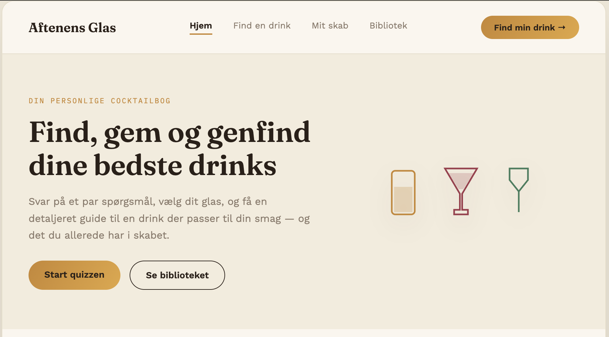
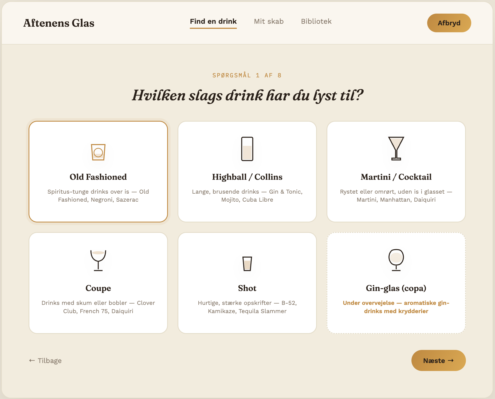
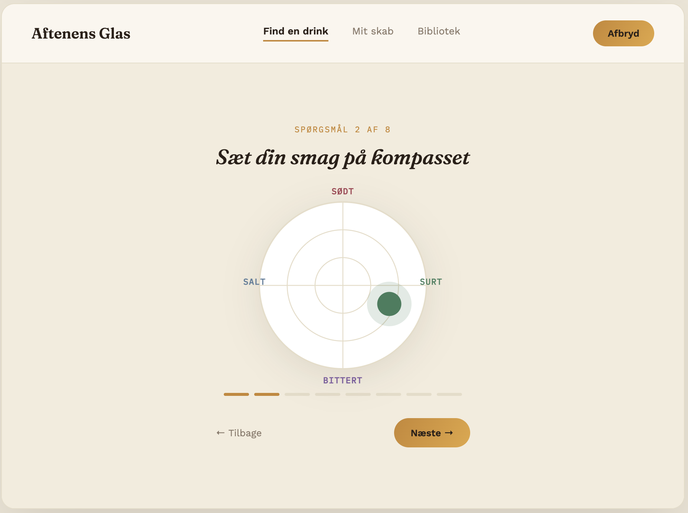
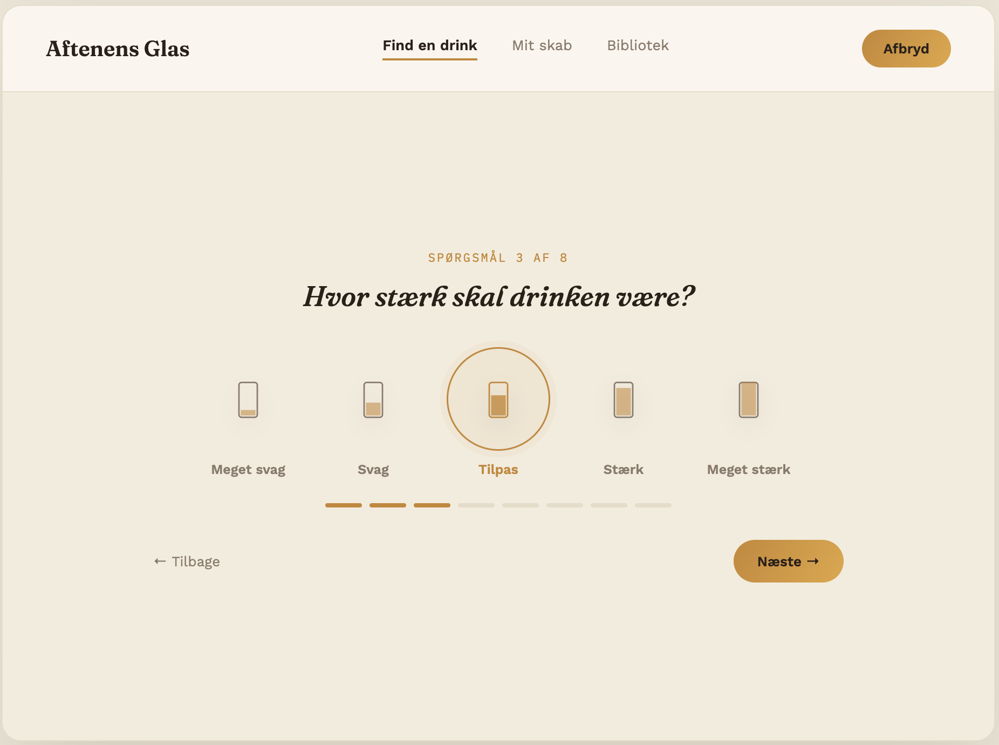
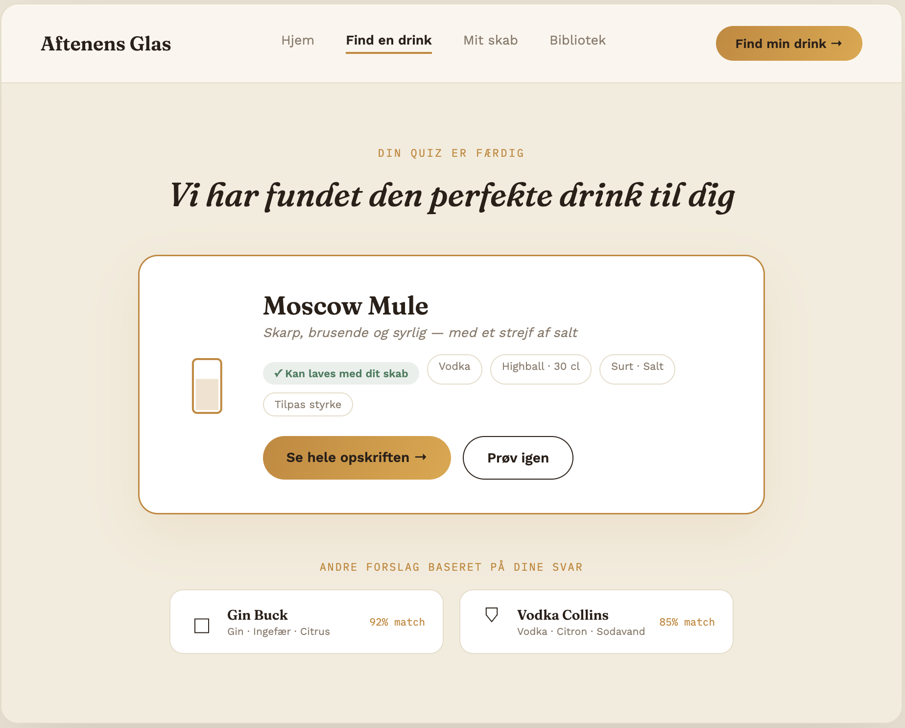
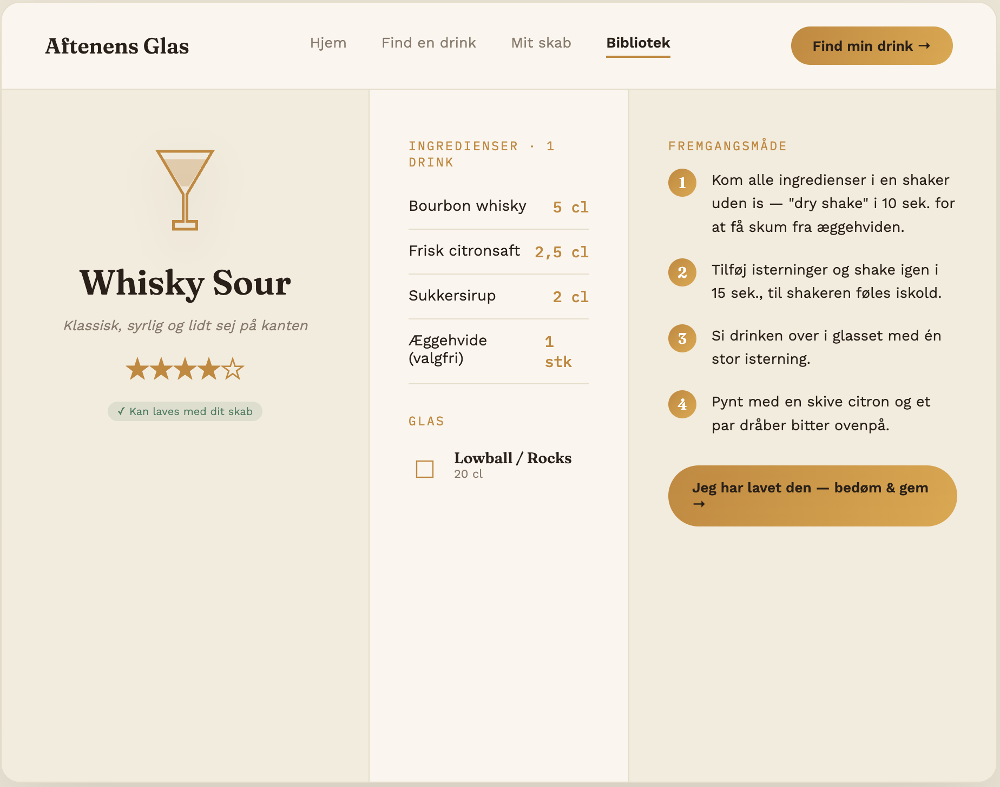

In week 1 of our third-semester project, I debated what kind of application I wanted to make. I had a few different ideas, but ultimately I settled on a particular idea that I had envisioned for a few months now.

## So what is the idea?

I am making a drinks application.
Imagine you are hosting an event and your guests have completely different tastes and wishes for what their drink should be. Instead of racking your brain trying to find drink recipes that are interesting and match each guest's taste exactly, wouldn't it be better if an app could do that for you?

This application is designed to make it easier for people to find and explore new drink recipes. The idea is that the user can answer a few questions about what kind of drink they want, how it should taste, and which ingredients should be used to make the drink.
It will be possible for the user to filter the recipes based on what they already have in their own kitchen, or if they would rather go out and buy the remaining ingredients.

I want it to be possible for the user to save and revisit earlier drink recipes that they liked — and maybe in the future, my system will be able to recommend similar recipes that fit the user's taste and past drink style.

## What I want the application to look like

Together with an AI, I made a few different mock-ups of the overall website and the questions that need to be answered for the system to know which drink recipe to recommend. I used an AI to save some time and to get the idea from my head and onto the screen as soon as possible.
It's important to emphasize that this is only the first mock-up, and the application will probably evolve a lot throughout the development process.

### Frontpage

On the frontpage, the most important features are for the user to be able to start the quiz and to revisit their saved recipes. Mostly, this is just the homepage and the user's way of navigating from page to page.

### Examples of the questions

These are just a few examples of how the quiz part is going to work. For the application to know which recipe is the best fit, a lot more questions need to be asked — but for now, this is just a taste of the final result.

### The recipe result

Last but not least, after the questions, the user will get the recipe that most closely matches the answers they gave. I want the system to be able to calculate the percentage chance that the user will like the recipe. I believe this will make it easier for the system to later tailor the recommended recipes to the user.
