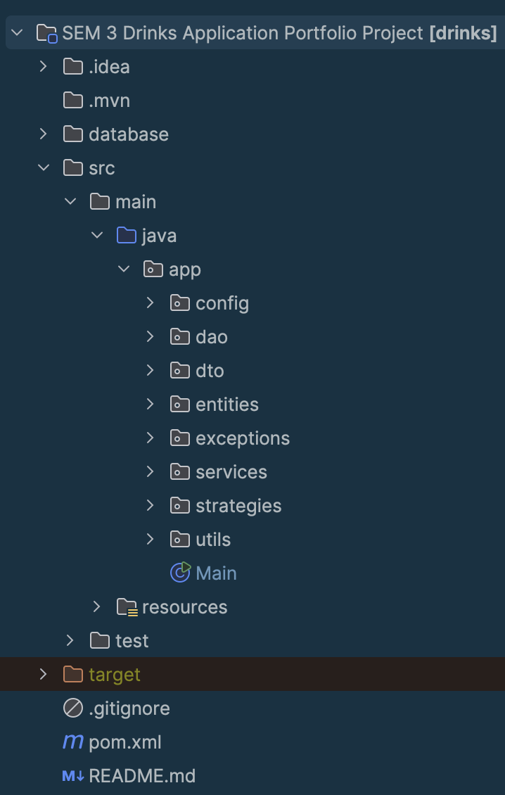

So, after a lot of planning and visualizing the final product, it was finally time to start coding - or rather, to set up the structure.
The first step was to create the repository and the README file, choose the expected technologies and set up the overall architectural structure.

## Repository

[](https://github.com/NicolineNV/SEM_3_Drinks_Application_Portfolio_Project.git)

The project is a cocktail application where the user goes through a quiz and is matched with a recipe that fits their mood and taste. The goal is for it to end up as a standalone REST API built with Javalin. The foundation is a Java application using Hibernate/JPA against PostgreSQL, built with Maven.

## Technology choices

At this point, I can't be 100% sure which technologies I am going to end up using, so this list might change during the build process. For now, though, I am at least sure I will be using these:

- **Java**, with **Maven** as the build tool
- **Hibernate (JPA)** for object-relational mapping
- **PostgreSQL** as the database
- **Lombok** to remove boilerplate in DTOs
- **BCrypt** (jBCrypt) for password hashing
- **Javalin** as the final REST framework 
- **JUnit 5 and Testcontainers** for tests

## Layering

The application is split into layers with a strict separation of responsibilities:

```
app
├── config        Hibernate setup and entity registration
├── entities      JPA entities (the data model)
├── dao           Data access (CRUD and queries)
├── dto           Data transfer objects in and out of the service layer
├── services      Business logic
├── strategies    Scoring algorithms (Strategy pattern)
├── exceptions    Error handling
└── utils         Helper functions
```

The principle is that each layer only knows about the layer below it. `services` knows nothing about SQL, `dao` knows nothing about business rules, and `entities` knows nothing about HTTP. This gives three concrete benefits: each layer can be tested in isolation, parts can be replaced without touching the rest (for example, the Javalin layer can be added later without changing the services), and responsibility is easy to place when new functionality is added.

## Folder structure

A very important part of a good project structure is a good folder structure. This keeps the whole project neat and, most importantly, makes sure that the separation of responsibilities between the layers is not compromised.



## User stories

As mentioned in the last entry, this project is driven by nine core user stories (account creation and login, saving favorites, the quiz covering drink family, taste and spirit, displaying the recommended recipe, and admin login and recipe creation). On top of that, there are nine "nice-to-have" stories (recommendations, sharing, drink strength, ratings, and so on) that will only be taken on if time allows. This keeps the scope under control. After all, the last thing I want is scope creep and a half-finished product because the scope was too big, with too many unnecessary features.