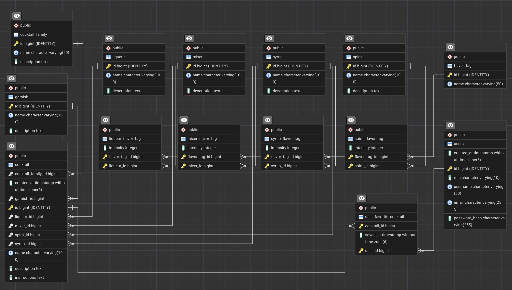

## Database

One of the first things I dug into was the relationships between the entities in my domain model, and how they would map to the tables in my database. The database has changed quite a bit from my original thinking when I drew up my first domain model. This is due to a number of challenges I ran into, and an even larger number of important decisions. This took my idea from a simple hand-drawn domain model to a detailed and well-thought-out database structure that satisfies `1NF`, `2NF` and `3NF`.

At the moment, my ERD diagram looks like this:



## Important decisions and reasoning

### Schema

I decided to build my `schema.sql` and database first before my Java entities. This means that the entities mirror the tables, and not the other way around. `schema.sql` is therefore "the truth", not Hibernate's auto-generated guesses.

To make sure it stays that way and that Hibernate does not override my SQL file, `schema.sql` lives in a directory called `database/` in the project root - not in `src/main/resources`. The SQL script is run manually, directly in PostgreSQL, when the database is set up, and therefore does not need to be packaged into the JAR file.

### FlavorTag

As I mentioned in the post about my idea, the user should be able to choose a cocktail based on a flavor preference. This is the most important aspect of my API - you could even go as far as to say it is part of the main purpose.

These flavor profiles are modeled as `FlavorTag` + **join tables** holding an `intensity` value **(1-5)** for each ingredient type, such as `spirit_flavor_tag`. Since an ordinary `@ManyToMany` relationship cannot hold extra columns, the join tables have to be entities of their own with composite keys.

```SQL
CREATE TABLE spirit_flavor_tag (
    spirit_id     BIGINT  NOT NULL REFERENCES spirit(id)     ON DELETE CASCADE,
    flavor_tag_id BIGINT  NOT NULL REFERENCES flavor_tag(id) ON DELETE CASCADE,
    intensity     SMALLINT NOT NULL CHECK (intensity BETWEEN 1 AND 5),
    PRIMARY KEY (spirit_id, flavor_tag_id)
);
```

### `CocktailMenu` join table

`CocktailMenu` was chosen to be a join table between `User` and `Cocktail`. Its main purpose is to hold the users' saved favorites, and also has an extra column, `saved_at`. This table covers a big part of user story 2.

```SQL
CREATE TABLE user_favorite_cocktail (
    user_id     BIGINT    NOT NULL REFERENCES users(id)    ON DELETE CASCADE,
    cocktail_id BIGINT    NOT NULL REFERENCES cocktail(id) ON DELETE CASCADE,
    saved_at    TIMESTAMP NOT NULL DEFAULT now(),
    PRIMARY KEY (user_id, cocktail_id)
);
```

### The main table `cocktail` - what defines it?

When I was building the tables and their relationships to each other, I asked myself an important question: **"What does a cocktail actually contain in my system?"**

This was an important question because I have chosen to split the ingredients into categories **Spirit**, **Liqueur**, **Mixer**, **Syrup** and **Garnish** - and therefore have these categories as columns in my `cocktail` table.

Cocktails such as the **Old Fashioned** only have a base alcohol **(Spirit)** and ice, so all the other category columns would end up being `NULL`. My thought was then to make **Liqueur**, **Mixer**, **Syrup** and **Garnish** nullable and keep only **Spirit** as `NOT NULL`, but that was not possible either, since some recipes are alcohol-free.

So in the end, only `cocktail_family_id` is `NOT NULL` among the relationships, and all the others are nullable.

This means that a **Cocktail** will always have a ***"family"*** (recipe group), and that the business rule that it contains ***"at least one ingredient"*** was moved to the service layer instead of being enforced as a DB constraint.

On top of that, **Non-alcoholic** is handled as a `CocktailFamily` **("Mocktails")**, not as a separate flag. That is simpler and fits the family filter in the quiz.

```SQL
CREATE TABLE cocktail (
    id                 BIGSERIAL PRIMARY KEY,
    name               VARCHAR(100) NOT NULL UNIQUE,
    description        TEXT,
    instructions       TEXT         NOT NULL,
    cocktail_family_id BIGINT       NOT NULL REFERENCES cocktail_family(id) ON DELETE RESTRICT,
    spirit_id          BIGINT       REFERENCES spirit(id)                   ON DELETE SET NULL,
    liqueur_id         BIGINT       REFERENCES liqueur(id)                  ON DELETE SET NULL,
    mixer_id           BIGINT       REFERENCES mixer(id)                    ON DELETE SET NULL,
    syrup_id           BIGINT       REFERENCES syrup(id)                    ON DELETE SET NULL,
    garnish_id         BIGINT       REFERENCES garnish(id)                  ON DELETE SET NULL,
    created_at         TIMESTAMP    NOT NULL DEFAULT now()
);
```

### Data from TheCocktailDB

**The database is seeded once** from TheCocktailDB, instead of the application making constant live calls to the API.

The reasoning is that the API does not contain flavor profiles, which, as I mentioned, are the core data of my system. The flavor profiles are necessary for the user to be able to filter the recipes by flavor.

In addition, the ingredients are just unstructured strings that have to be normalized in my database anyway, and my admin story (9) assumes that my own database is the source of truth. That is the user story that lets an Admin add new recipes to the database.
